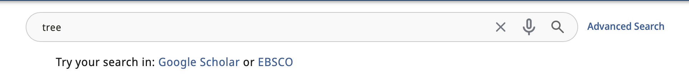
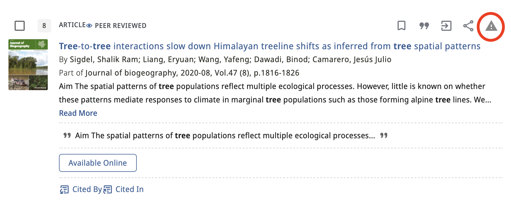
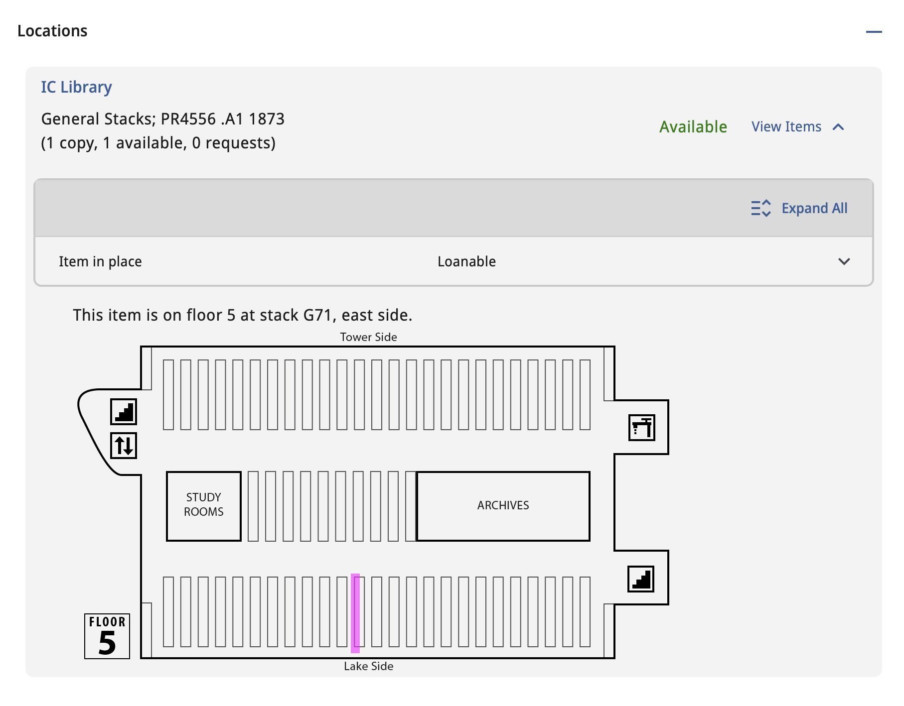

# Ithaca College Library Primo VE NDE Customizations

## Getting Started

See [Ex Libris Group/customModule](https://github.com/ExLibrisGroup/customModule) for information on setting up a local development environment and the basics of customization.

## Overview

This repo contains the customization package for Ithaca College Library's Primo VE NDE. Most importantly, it contains these three custom components:

### OtherSearchComponent

Creates "try your search in..." links to Google Scholar and EBSCO Research Library. This is a fairly simple component with one wrinkle: it polls `window.location` once every 500 milliseconds to get the current URL and re-write the Google Scholar and EBSCO links if necessary. It seems like this could be done more elegantly by injecting the `SHELL_ROUTER` as described in the [customModule README](https://github.com/ExLibrisGroup/customModule#accessing-app-router), but I haven't been able to make that work. This component could easily be customized for other search services. Built on `nde-top-bar-after`.

### ReportProblemComponent

Adds a "report a problem" icon link to the "actions" area in both the brief view and the full view. The link points to our own form for record problems, but you could modify the component to point anywhere. The URL will carry various data points along as parameters so that whatever form is on the other end can use them for pre-filling and/or to pass along to another system. Built on `nde-record-actions-bottom`.

### StackMapComponent

IC's own custom system for mapping physical items to the stack or the appropriate service desk in the case of closed-stack items. This is just the latest iteration of a system that we've been using for ages. Stack and call number info is stored in JSON files (`app/stack-map/data`). The component looks at `hostComponent.location` to gather information like call number, location code, and availability. Based on that data, it looks up the location in the appropriate JSON file. If the location is an `ICBlob` (a location that is small enough not to need stack level mapping like "atlas case"), it retrieves a floor number, along with x, y, height, and width coordinates. If the location is mapped to the stack level (an `ICLocation`), the component goes through the appropriate JSON file to find the specific stack, returning a stack id (which includes a floor number) and x, y, height, and width values. The floor number is used to display the appropriate floor map. The x, y, height, and width coordinates are used to draw a rectangle on a canvas that is superimposed on the floor map. The rectangle indicates the location of the item. This component is built on `nde-location-items-container-after`.

### Other Components

I have over-ridden the `nde-collection-discovery-gallery-collection` and the `nde-collection-discovery-thumbnail` components. These display as simple tiles with big SVG icons representing the type of collection. This might be useful for those librarys with collections that don't work well with the pictorial approach taken by Ex Libris.

